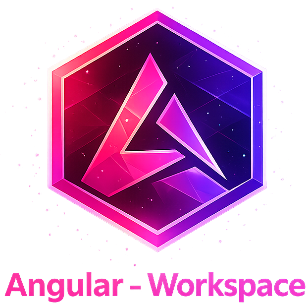
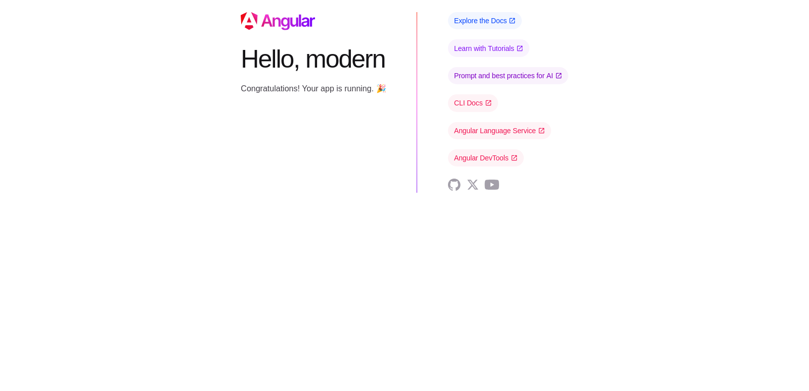
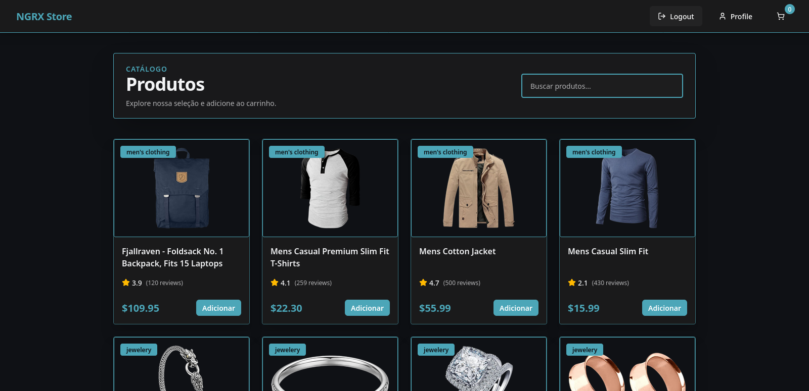
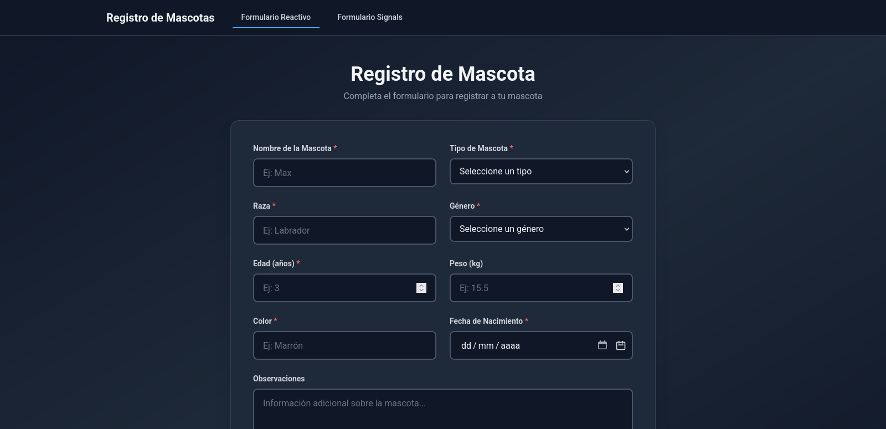
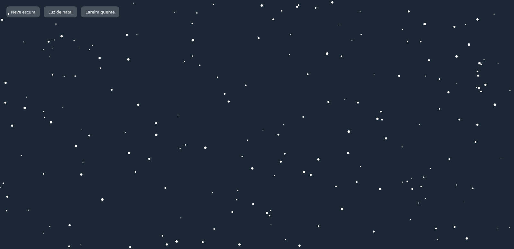
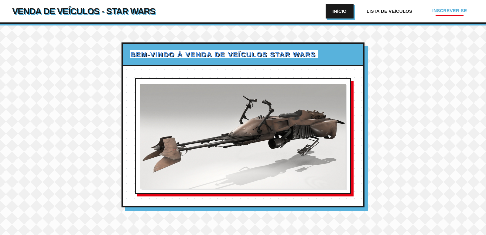
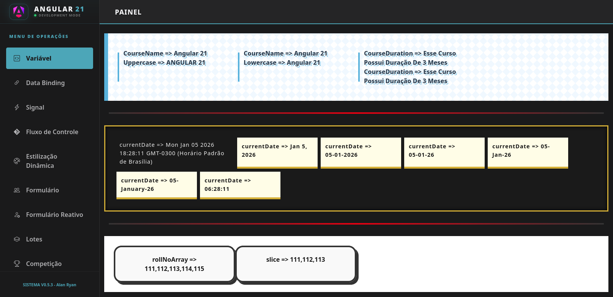

<p align="center">
    
</p>

<div align="center">


</div>

## 🧭 Guia de Navegação (Índice)

- **[📖 Descrição](#descricao)**
- **[🎯 Sobre o Projeto](#sobre-o-projeto)**
- **[📁 Estrutura do Repositório](#estrutura-do-repositorio)**
- **[🚀 Como Executar](#como-executar)**
- **[✨ Destaques dos Projetos](#destaques-dos-projetos)**
- **[👤 Sobre o Desenvolvedor](#sobre-o-desenvolvedor)**
- **[📚 Recursos Adicionais](#recursos-adicionais)**
- **[📜 Licença](#licenca)**

## Angular Workspace

## 📖 Descrição <a name="descricao"></a>

Este repositório reúne uma coleção prática e progressiva de projetos Angular — desde aplicações básicas até projetos que exploram recursos modernos do framework. O objetivo é ensinar por meio do código: cada exemplo foi pensado para ser executável, bem documentado e fácil de entender.

## 🎯 Sobre o Projeto <a name="sobre-o-projeto"></a>

Este repositório serve como um guia prático de aprendizado Angular. Cada projeto demonstra conceitos específicos do framework Angular, incluindo:

- Fundamentos do framework
- Componentes e templates
- Gerenciamento de estado (NgRx Store)
- Reactive Forms e Signal-based Forms
- Animações e efeitos visuais
- Boas práticas de desenvolvimento

## 📁 Estrutura do Repositório <a name="estrutura-do-repositorio"></a>

```bash
.
├── resources/
│   └── images/
├── src/
│   ├── modern/
│   ├── ngrx-store/
│   ├── signal-forms/
│   ├── snowfall-animation/
│   ├── sw-vehicles/
│   └── tutorial/
├── LICENSE
└── README.md
```

## 🚀 Como Executar <a name="como-executar"></a>

1. **Clone o repositório:**

   ```bash
   git clone https://github.com/0nF1REy/angular-workspace.git
   cd angular-workspace
   ```

2. **Execute um projeto específico:**

   ```bash
   # Navegue até o projeto desejado
   cd src/tutorial/

   # Instale as dependências
   npm install

   # Execute o servidor de desenvolvimento
   npm start
   # ou
   ng dev

   # Acesse no navegador: http://localhost:4200
   ```

3. **Compilar para produção:**

   ```bash
   npm run build
   # ou
   ng build
   ```

## ✨ Destaques dos Projetos <a name="destaques-dos-projetos"></a>

### Modern Angular App



### NgRx Store Example



### Signal Forms Example



### Snowfall Animation



### Star Wars Vehicles App



### Tutorial App



## 👤 Sobre o Desenvolvedor <a name="sobre-o-desenvolvedor"></a>

<table align="center">
  <tr>
    <td align="center">
        <br>
        <a href="https://github.com/0nF1REy" target="_blank">
          
        </a>
        </p>
        <a href="https://github.com/0nF1REy" target="_blank">
          <strong>Alan Ryan</strong>
        </a>
        </p>
        ☕ Peopleware | Tech Enthusiast | Code Slinger ☕
        <br>
        Apaixonado por código limpo, arquitetura escalável e experiências digitais envolventes
        </p>
          Conecte-se comigo:
        </p>
        <a href="https://www.linkedin.com/in/alan-ryan-b115ba228" target="_blank">
          
        </a>
        <a href="https://gitlab.com/alanryan619" target="_blank">
          
        </a>
        <a href="mailto:alanryan619@gmail.com" target="_blank">
          
        </a>
        </p>
    </td>
  </tr>
</table>

</div>

---

## 📚 Recursos Adicionais <a name="recursos-adicionais"></a>

- [Documentação Oficial Angular](https://angular.dev/)
- [Angular CLI](https://angular.dev/cli)
- [NgRx Store](https://ngrx.io/)
- [RxJS](https://rxjs.dev/)

## 📜 Licença <a name="licenca"></a>

Este projeto está sob a **licença MIT**. Consulte o arquivo **[LICENSE](LICENSE)** para obter mais detalhes.

> ℹ️ **Aviso de Licença:** &copy; 2025-2026 Alan Ryan da Silva Domingues. Este projeto está licenciado sob os termos da licença MIT. Isso significa que você pode usá-lo, copiá-lo, modificá-lo e distribuí-lo com liberdade, desde que mantenha os avisos de copyright.

⭐ Se este repositório foi útil para você, considere dar uma estrela!
